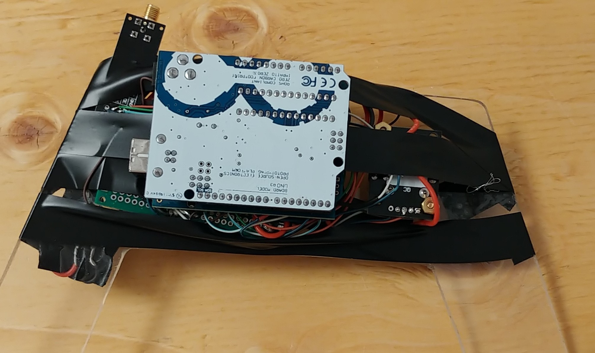
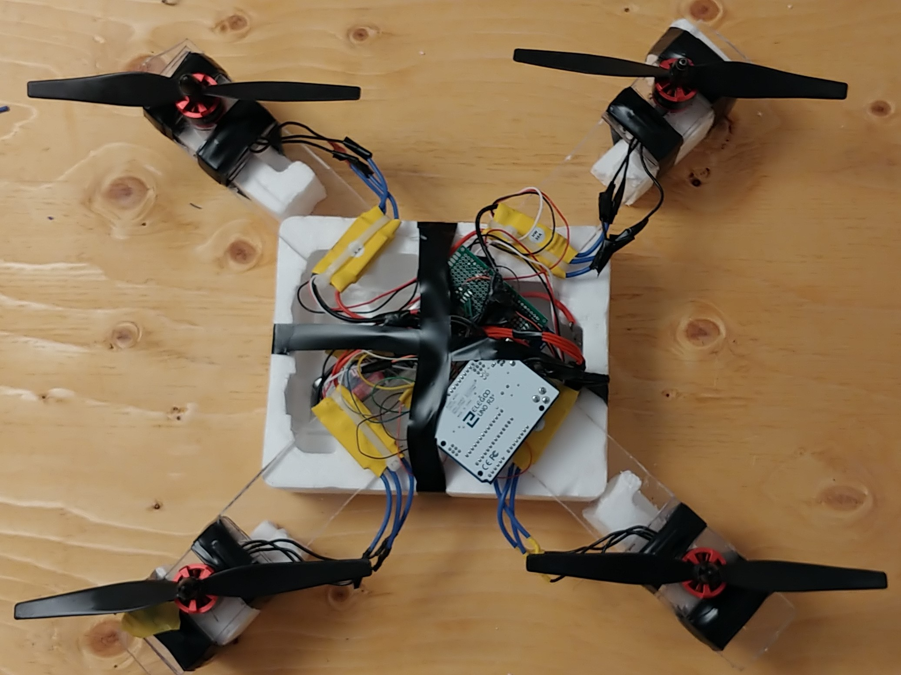

# Self Leveling Quadcopter
As you can tell by the title this project is a self leveling quadcopter that I built using an Arduino Uno. This project is just something that I wanted to try to build for fun and to see if I could make a semi functional drone that has a functional self leveling feature. I have writen 2 versions of the code Manual and SelfLevel. Manual you use the joystick to change the amount of power going to each motor. Self Level you use the joystick to change the tilt angle and the arduino does all the leveling for you.

## Photos and Videos
[Video of the Drone Flying](https://youtu.be/ctLI9JnbgVA)

>Front of the controller

>Back of the controller

>Top of the drone

Sorry for the mess of Electrical Tape I ran out of Plexi Glass and Screws. Also the frame cracked so I put Electrical Tape over the screws for the motors just in case.

## Getting Started
These instructions will get you a flying drone.

### Prerequisites
#### Parts List
  * 2 Arduinos 
  * 3 10K Resistors
  * 1 10K Potentiometer
  * 1 KY-023 Analog Joystick
  * 3 Push Buttons
  * 1 MPU6050 Gyroscope and Accelerometer
  * 1 Wireless Receivers
  * 1 Wireless Transmitters
  * 4 BLDC Motors 
  * 4 Motor Controllers 
  * 1 3S 40C 2200mah Lipo Battery
  * 1 9V Battery
  * 1 Plexiglass Drone Frame
  * 1 Plexiglass Controller Frame

### Installing
#### Steps
 1. Download the repository.
 1. Using the drawing provided, cut out the drone frame, controller frame, 4 brackets for the motor, and 4 spacers.
 1. Wire up the controller and drone using the schematics provided.
 1. Upolad the code to the arduino. (there are 2 folders Manual and SelfLevel)
 1. Start flying.
 
## Built With 
C++
