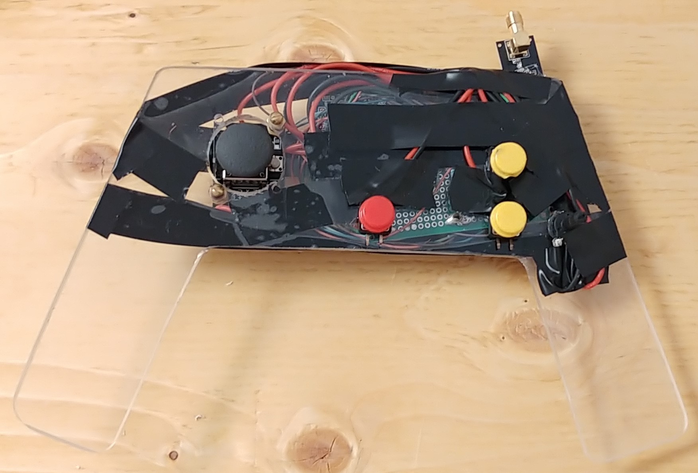

# Self Leveling Quadcopter
[Video of the Drone Flying](https://youtu.be/ctLI9JnbgVA)


>Front of the controller


>Back of the controller


>Topview of the drone

Sorry for the mess of Electrical Tape I ran out of Plexi Glass and Screws.

## Getting Started
These instructions will get you a flying drone.

### Prerequisites
2 arduinos 

4 motors 

4 motorcontrollers 

2 wireless receivers/transmitters

### Installing
Download the source code.
```
git clone https://github.com/AbdelhalemKassara/Self_Leveling_Quadcopter.git
```

## Built With 
arduino(c++)
